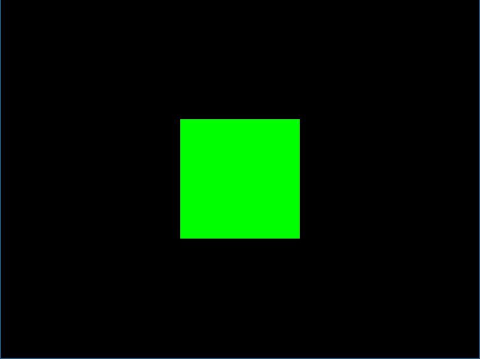
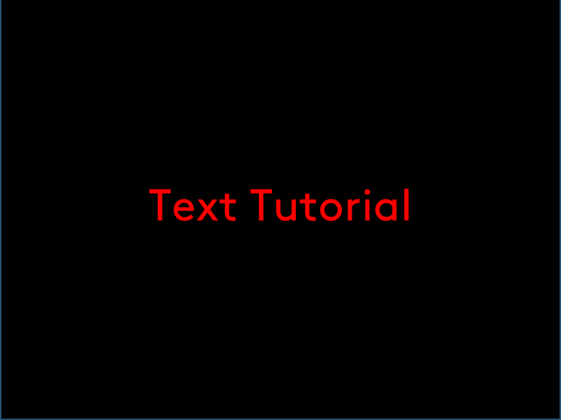
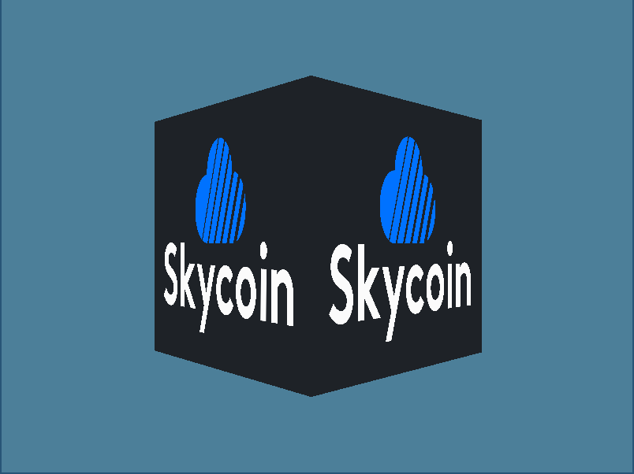
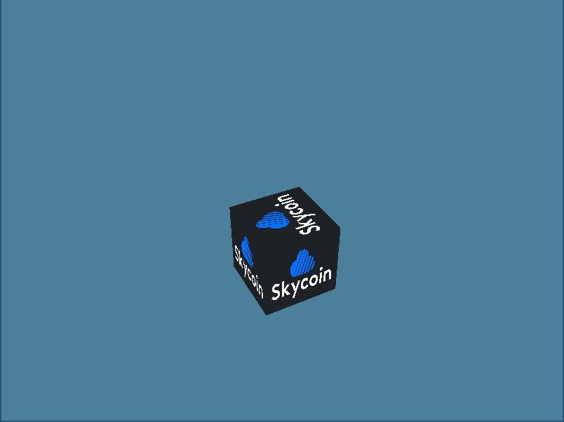
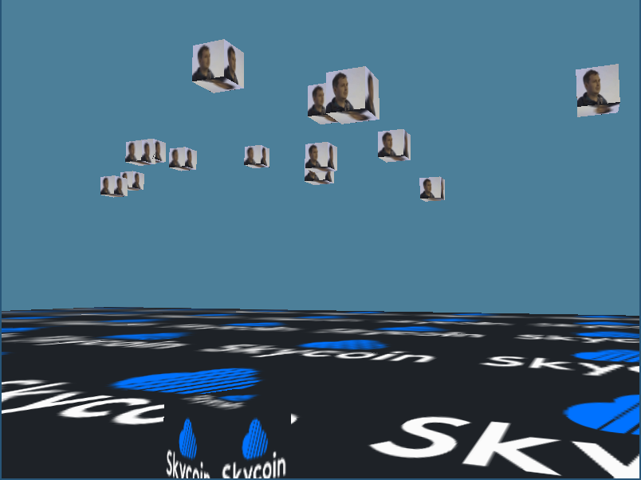
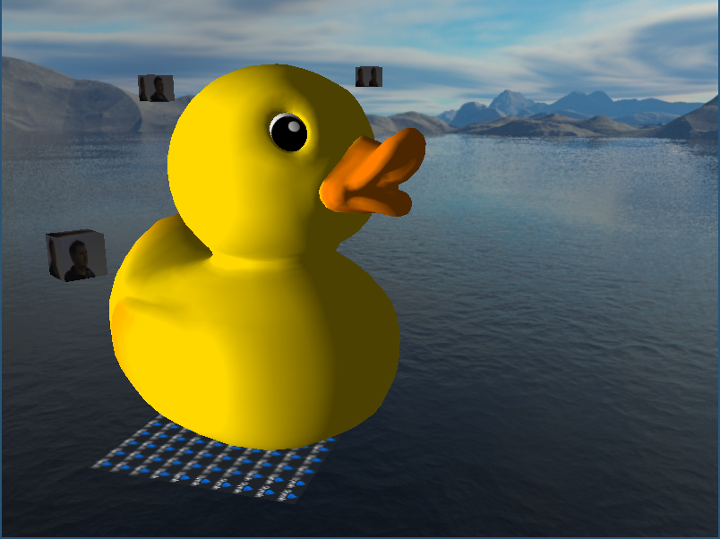
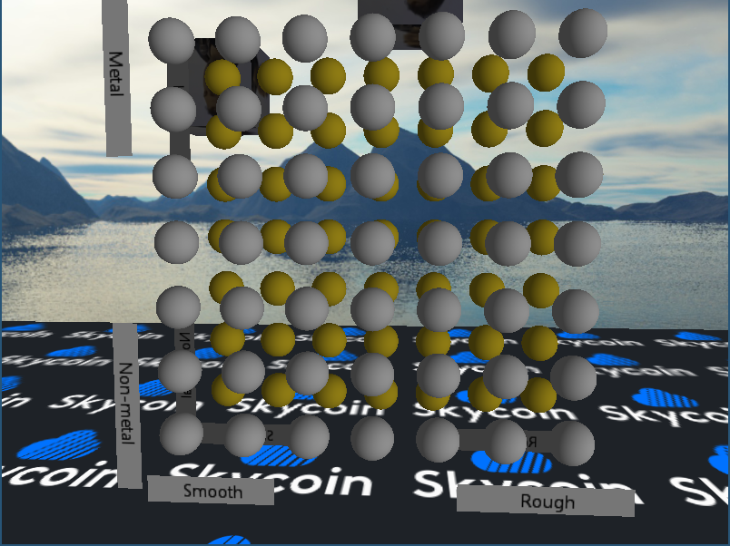
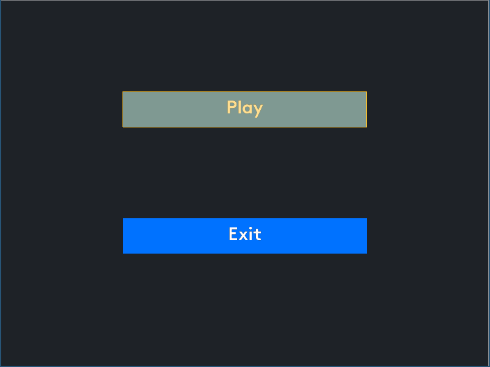
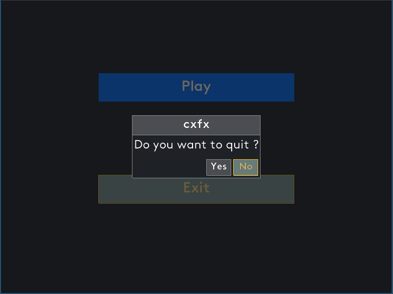

## Disclaimer : It’s all wip, api will change until it matures.

## Cx game library.

#### Installation :

##### Install patched cx (cxfx temporarly relies on unpublished cx modifications, this will be fixed in the future):
```
mkdir -p ~/go/src/github.com/skycoin/
cd ~/go/src/github.com/skycoin/
git clone https://github.com/asahi3g/cx/
cd cx
git checkout develop_cxfx
make build
```
##### Install cxfx :
```
mkdir -p ~/go/src/github.com/skycoin/
cd ~/go/src/github.com/skycoin/
git clone https://github.com/skycoin/cxfx
cd cxfx/tutorials
make 6_model
```

##### Controls in tutorials :

```ctrl+(left/right)``` : Switch rendered model
 
```up/down/left/right (or wasd) + mouse``` : Control the camera 

```alt+enter``` : Toggle fullscreen 

```escape``` : Exit 

#### Wip :

- [ ] math:
  - [ ] matrix
    - [x] basic matrix operations
  - [ ] vector
  - [ ] quaternion
  - [ ] spline
- [ ] graphics:
  - [ ] textures:
    - [ ] texture 2d
      - [x] generate mipmaps
      - [ ] load mipmaps
    - [ ] texture cube 
      - [x] generate mipmaps
      - [ ] load mipmaps
    - [ ] texture array
    - [ ] texture 3d
    - [ ] texture compression
    - [ ] srgb
  - [ ] shaders:
    - [x] shader permutations
    - [ ] shader hot reload
    - [ ] shader reflection (parse glsl and extract uniforms)
    - [ ] shader uniform binding in gui
  - [ ] rendering:
    - [ ] physically based renderer
      - [x] kronos implementation
        - [ ] debug
      - [ ] diffuse irradiance
      - [ ] specular irradiance
      - [ ] hdr maps
      - [ ] custom brdf
      - [ ] realtime cubemap
    - [ ] normal map
    - [ ] emmissive map
    - [ ] occlusion map
    - [ ] order independent transparency
    - [ ] particles
    - [ ] anti aliasing
    - [ ] atmospheric scattering
  - [ ] terrain
- [ ] audio:
  - [x] wav 8bps/16bps
  - [ ] wav f32/f64
  - [ ] 3d audio
  - [ ] audio streaming:
  - [ ] compressed audio
- [ ] phycics:
  - [ ] collision/intersection/response
    - [ ] ellipsoid/triangle
    - [ ] ellipsoid/ellipsoid 
    - [ ] ray/ellipsoid
    - [ ] ray/OBB
    - [ ] ray/AABB
  - [ ] gravity
  - [ ] torque
- [ ] cameras:
  - [x] free camera
  - [ ] first person camera
  - [ ] third person camera
  - [ ] smooth motions
  - [ ] cinematic camera
- [ ] gltf support (loader/renderer/exporter):
  - [x] flat mesh
  - [x] textured mesh
  - [x] hierarchical mesh
  - [x] pbr materials
  - [ ] skinning
  - [ ] animations
  - [ ] cameras
  - [ ] lights
  - [ ] exporter
- [ ] 2d gui toolkit:
  - [x] game screens
  - [x] label
  - [x] picture
  - [x] scrollbar
  - [x] list
  - [ ] json serialization
- [ ] application:
  - [x] resize events
  - [x] toggle fullscreen
  - [ ] cli
  - [ ] mobile:
    - [ ] virtual keyboard
    - [ ] ios
    - [ ] android
- [ ] skycoin:
  - [ ] cxo
  - [ ] blockchain


#### How to contribute :

- testing the tutorials
- writing documentation for the tutorials code
- writing tutorials
- writing apps with cxfx
- writing documentation for the lib (should be driven by the tutorials)
- feedback regarding the usage (what needs to be improved, what functionalities are missing etc)
- 3d assets (synth 3d model and animations, skycoin hardware...)
- audio assets (synth sound pack)

#### Tutorials :

```
make 0_colored_quad
```


```
make 1_textured_quad
```


```
make 2_text
```


```
make 3_perspective
```


```
make 4_camera
```


```
make 5_batch
```


```
// WIP skyminer
make 6_model
```


```
// WIP pbr
make 6_model
```


```
make 7_menu
```
TODO : add screenshot

```
make 8_sound
```
TODO : add screenshot

```
make 9_button
```


```
make 10_dialog
```


